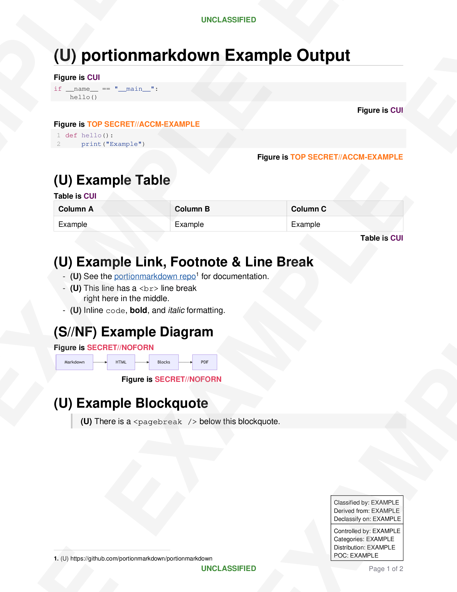
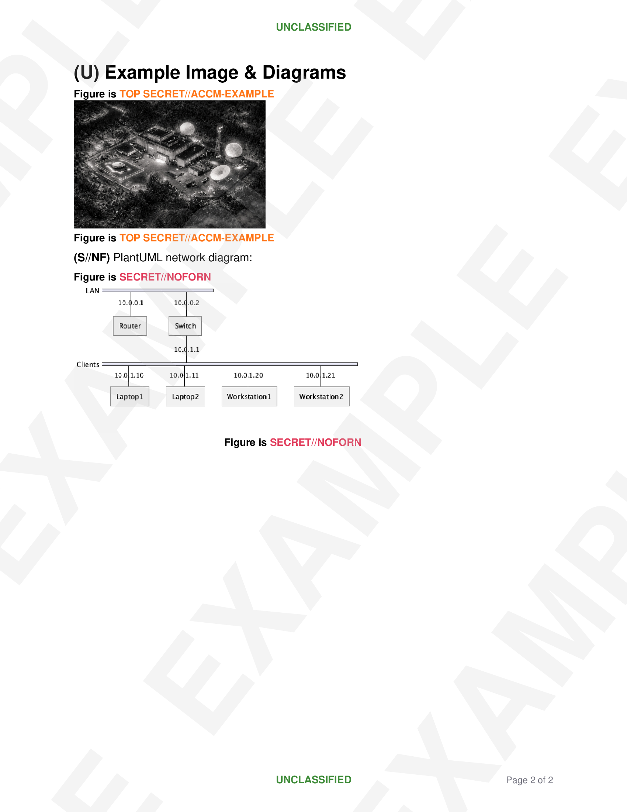

# portionmarkdown

> [!WARNING]
> This tool is a formatting aid, not an authority on classification or marking policy. It does not validate classification hierarchy, enforce need-to-know, or verify that markings comply with applicable guidance (EO 13526, DoDM 5200.01, ISOO directives, or agency-specific rules). Users are responsible for ensuring all markings, classification levels, and dissemination controls are correct. All classification markings and example content in this repository are fictitious.

Render Markdown to PDF with portion markings, classification banners, CUI designations, and classification/CUI authority blocks. Generates PDF 1.4 directly with no external dependencies. A VS Code extension with live preview.

## Example Output

| Page 1 | Page 2 |
|--------|--------|
|  |  |

## VS Code Extension

### Installation

Download the `.vsix` from the [releases page](https://github.com/portionmarkdown/portionmarkdown/releases) and install with:

```bash
code --install-extension portionmarkdown-*.vsix
```

This works offline — no marketplace access required. The extension activates automatically on any `.md` file.

#### Optional external tools

Diagram rendering requires external tools that are **not** bundled in the extension:

| Tool | Required for | Notes |
|------|-------------|-------|
| **Java** | PlantUML diagrams | JRE or JDK |
| **PlantUML** | ` ```plantuml ` blocks | CLI wrapper or `.jar` file |
| **Graphviz** | ` ```dot ` / ` ```graphviz ` blocks | Provides the `dot` command |

Mermaid diagrams (` ```mermaidjs `) render with bundled dependencies and require no external tools.

To build from source:

```bash
cd vscode-portionmarkdown
npm install && npm run compile
```

### Commands

All commands are available from the editor right-click context menu on Markdown files.

| Command | Context Menu | Description |
|---------|-------------|-------------|
| **Wrap Selection with Portion Marking** | Right-click (with text selected) | Wraps the selection in a `<div marking="KEY" markdown="1">` block. Opens a quick-pick with recently used, document-defined, and settings-defined markings. |
| **Insert Template Block** | Right-click submenu | Insert classification, CUI, or markings blocks. |
| **Preview PDF** | Right-click | Opens a live PDF preview in a side panel. Auto-refreshes as you edit (800 ms debounce). |
| **Export to PDF** | Right-click / file explorer | Exports the Markdown file to PDF alongside the source. |
| **Export Watermarked PDF** | Right-click / file explorer | Exports the Markdown file to PDF with diagonal "EXAMPLE" watermark overlay. |
| **Save Diagram as PNG** | Right-click (cursor in diagram block) | Renders a ` ```mermaidjs `, ` ```plantuml `, or ` ```dot ` code block to PNG and saves it. |

The **Insert Template Block** submenu offers Classification, CUI, and Markings block insertion with quick-pick selection from blank, recently used, and settings-defined templates.

### Extension Settings

Configure in VS Code settings (JSON) under `portionmarkdown.*`. All settings can be defined at user or workspace level.

#### `portionmarkdown.font`

Font family used in PDF output. Options: `"Default"` or `"Computer Modern"`.

- **Default** — Uses the PDF standard Helvetica/Courier fonts. These are built into every PDF reader so the output is compact, but rendering varies slightly across platforms.
- **Computer Modern** — Embeds the Computer Modern Unicode font family (serif, bold, italic, monospace) directly in the PDF. Renders identically on every platform.

#### `portionmarkdown.commonMarkings`

Common marking definitions available in the **Wrap Selection** quick-pick, in addition to the document's `<!-- markings -->` block. Useful for a standard set of classification levels shared across projects.

```jsonc
"portionmarkdown.commonMarkings": [
  { "key": "U",     "short": "U",     "long": "UNCLASSIFIED" },
  { "key": "S",     "short": "S",     "long": "SECRET" },
  { "key": "EXAMPLE",    "short": "TS//ACCM-EXAMPLE",    "long": "TOP SECRET//ACCM-EXAMPLE" },
]
```

| Field | Required | Description |
|-------|----------|-------------|
| `key` | Yes | Value used in `<div marking="KEY">` |
| `short` | Yes | Portion marking prefix shown in the PDF (e.g. `S`) |
| `long` | Yes | Full classification name for figure/table labels (e.g., `SECRET`) |

#### `portionmarkdown.commonClassificationBlocks`

Named classification block templates (SCG data). Each entry appears as a quick-pick option when inserting a classification block.

```jsonc
"portionmarkdown.commonClassificationBlocks": [
  {
    "name": "CG-EXAMPLE", // Display name in the quick-pick
    "marking": "SECRET",  // Overall classification of document
    "classifiedBy": "Classified by",
    "derivedFrom": "CG-EXAMPLE, dated dd Mon YYYY",
    "declassifyOn": "dd Mon YYYY"
  },
]
"portionmarkdown.commonCuiBlocks": [
  {
    "name": "Boilerplate OPSEC CUI Block", // Display name in the quick-pick
    "controlledBy": "Controlling office",
    "categories": "OPSEC",
    "distribution": "F",
    "poc": "example"
  },
]
```

#### `portionmarkdown.plantumlPath`

Path to the `plantuml` binary or `plantuml.jar` file. Leave empty to auto-detect from `PATH` or the `PLANTUML_JAR` environment variable.

```jsonc
"portionmarkdown.plantumlPath": "/opt/homebrew/bin/plantuml"
// or
"portionmarkdown.plantumlPath": "/usr/local/lib/plantuml.jar"
```

#### `portionmarkdown.javaPath`

Path to the `java` executable used when running a `plantuml.jar` file. Leave empty to use `java` from `PATH`.

```jsonc
"portionmarkdown.javaPath": "/usr/lib/jvm/java-21/bin/java"
```

#### `portionmarkdown.graphvizPath`

Path to the Graphviz `dot` executable. Leave empty to auto-detect from `PATH`.

```jsonc
// Linux / macOS
"portionmarkdown.graphvizPath": "/usr/bin/dot"
// Windows
"portionmarkdown.graphvizPath": "C:\\Program Files\\Graphviz\\bin\\dot.exe"
```

The extension remembers your 5 most recently used markings and templates across sessions.

### Real-Time Diagnostics

The extension validates your document as you type and reports errors/warnings in the Problems panel:

| Severity | Check |
|----------|-------|
| Error | Nested `<div marking>` blocks (not allowed) |
| Error | Unclosed `<div marking>` blocks |
| Error | Undefined marking key in a `<div marking="KEY">` |
| Error | UNCLASSIFIED document has portion markings or a classification block |
| Error | Classified document has no banner marking |
| Warning | CUI content exists but no `<!-- cui -->` block |
| Warning | Classified document missing classification authority block |
| Warning | Classified document has no portion-marked content (ISOO requirement) |

Diagnostics are anchored to the relevant source line. Validation is skipped for documents with `example: true` in the classification block. Matching `<div marking>`/`</div>` pairs are highlighted when the cursor is on either tag.

---

## Markdown Format

Documents are standard Markdown with HTML comment blocks that control classification metadata. What you need depends on the document's classification level:

**For classified documents** (SECRET, TOP SECRET, CONFIDENTIAL), you need all three blocks:

1. A `<!-- classification -->` block with the overall document marking and classification authority (Classified By, Derived From, Declassify On). The `marking` field sets the banner classification for the entire document.
2. A `<!-- markings -->` block defining the portion marking keys used in the document.
3. Portion markings on all content — wrap every content block in `<div marking="KEY" markdown="1">`. Per ISOO, if you portion-mark anything, portion-mark everything.

**For CUI documents**, you need:

1. A `<!-- cui -->` block with CUI designation info (Controlled By, Categories, Distribution, POC).
2. A `<!-- markings -->` block. Portion markings are not required for CUI but can be used.

**For UNCLASSIFIED documents**, no metadata blocks are needed. Adding `show-blocks: true` and `example: true` in a classification block forces the blocks to render anyway (useful for training/example documents).

### Example document structure

```markdown
<!-- classification
marking: SECRET
Classified By: Classified by
Derived From: CG-EXAMPLE, dated dd Mon YYYY
Declassify On: dd Mon YYYY
-->

<!-- cui
Controlled By: Controlling office
Categories: OPSEC
Distribution: F
POC: example
-->

<!-- markings
U: U | UNCLASSIFIED
S: S | SECRET
EXAMPLE: TS//ACCM-EXAMPLE | TOP SECRET//ACCM-EXAMPLE
-->

<div marking="U" markdown="1">

This is an unclassified paragraph.

</div>

<div marking="EXAMPLE" markdown="1">

This is a TOP SECRET//ACCM-EXAMPLE paragraph.

</div>
```

Marking format is `KEY: SHORT | LONG` — KEY is used in `<div marking="KEY">`, SHORT is the inline prefix, LONG is the full name for figure/table labels. The `markdown="1"` attribute is required for Markdown processing inside `<div>` blocks.

### Supported Markdown features

- Headings, bold, italic, strikethrough, inline code
- Fenced code blocks with syntax highlighting, line wrapping, and optional line numbers (`{startline=N}`)
- Mermaid diagrams (` ```mermaidjs `) — rendered locally via jsdom + resvg-wasm, no cloud services
- PlantUML diagrams (` ```plantuml `) — rendered locally via the system `plantuml` command (requires Java)
- Graphviz/DOT diagrams (` ```dot ` or ` ```graphviz `) — rendered locally via the system `dot` command
- Blockquotes (`>`) with nesting support
- Tables with header row styling, alternating row shading, per-cell portion markings, and cross-page splitting
- Images (JPEG/PNG) with `{ width=N% }` sizing (clamped to content width)
- Links (rendered as clickable blue underlined text)
- Ordered and unordered lists with nesting
- Footnotes (`[^label]` / `[^label]: text`) — rendered per-page at the bottom with inline formatting support (bold, italic, code, links)
- `<br>` line breaks and `<pagebreak />` page breaks
- Horizontal rules (`---`)

See [example.md](example.md) for a full example.

### Validation

The extension validates structural consistency (matching blocks, required metadata, marking definitions) before generating a PDF.

## License

MIT
