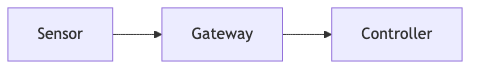
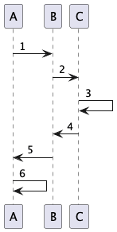
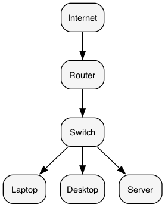

<!-- classification
marking: UNCLASSIFIED
example: true
show-blocks: true
Classified by: EXAMPLE
Derived from: EXAMPLE
Declassify on: EXAMPLE
-->

<!-- cui
Controlled by: EXAMPLE
Categories: EXAMPLE
Distribution: EXAMPLE
POC: EXAMPLE
-->

<!-- markings
U: U | UNCLASSIFIED
CUI: CUI | CUI
S: S | SECRET
EXAMPLE: TS//ACCM-EXAMPLE | TOP SECRET//ACCM-EXAMPLE
-->

<div marking="U" markdown="1">

# portionmarkdown Example Output

---

</div>

<div marking="S" markdown="1">

```python
if __name__ == "__main__":
    hello()
```

</div>

<div marking="EXAMPLE" markdown="1">

```python { startline=1 }
def hello():
    print("Example")
```

</div>

<div marking="CUI" markdown="1">

## Example Table

| Column A | Column B | Column C |
|----------|----------|----------|
| Example  | Example  | Example |

</div>

<div marking="U" markdown="1">

## Example Link, Footnote & Line Break

- See the [portionmarkdown repo](https://github.com/portionmarkdown/portionmarkdown)[^1] for documentation.
- This line has a `<br>` line break<br>right here in the middle.
- Inline `code`, **bold**, and *italic* formatting.

[^1]: (U) https://github.com/portionmarkdown/portionmarkdown

</div>

<div marking="U" markdown="1">

## Example Diagram

{ width=48% }

</div>

<div marking="U" markdown="1">

## Example Blockquote

> There is a `<pagebreak />` below this blockquote.

<pagebreak />

## Example Image & Diagrams

</div>

<div marking="U" markdown="1">

{ width=45% }

</div>

<div marking="U" markdown="1">

PlantUML sequence diagram:

{ width=20% }

</div>

<div marking="U" markdown="1">

Graphviz network:

{ width=25% }

</div>
